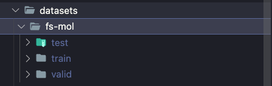

### Downloading The plain FS-MOL Dataset

1. First download the tar file.

```
curl -L https://figshare.com/ndownloader/files/31345321 --output datasets/fs-mol.tar
```

2. Extract the tar file inside the root `./datasets` folder.

```
tar -xvf datasets/fs-mol.tar -C datasets
```

3. In the end your `./datasets` folder should look like the following:

